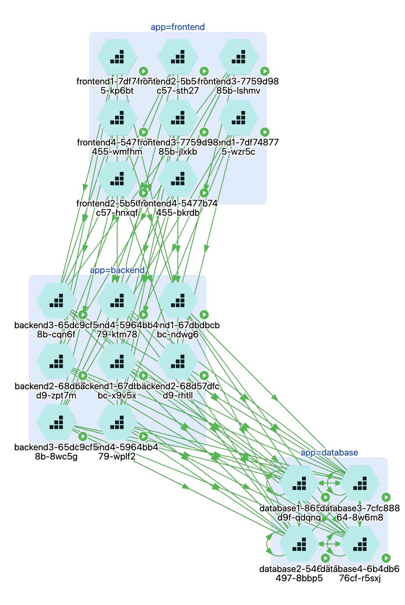
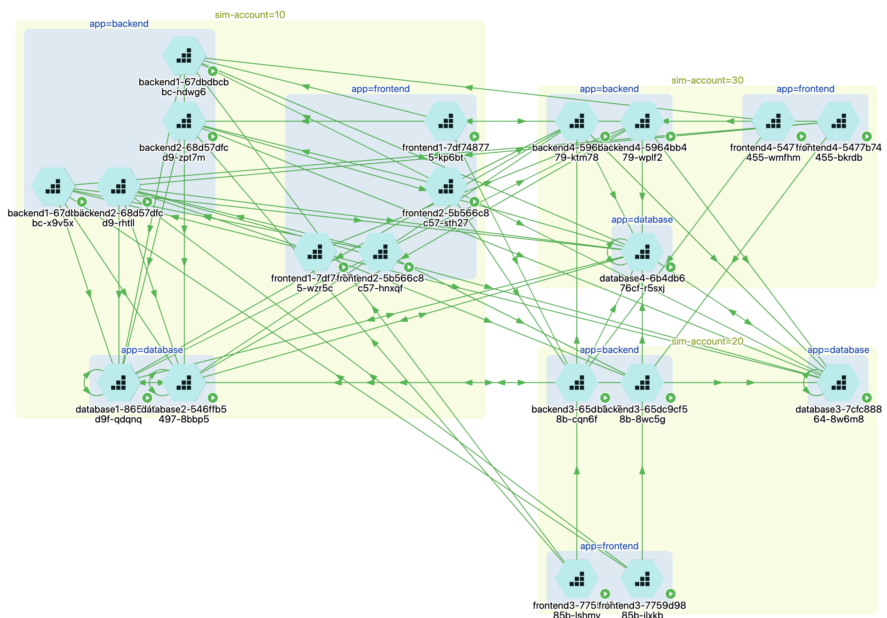
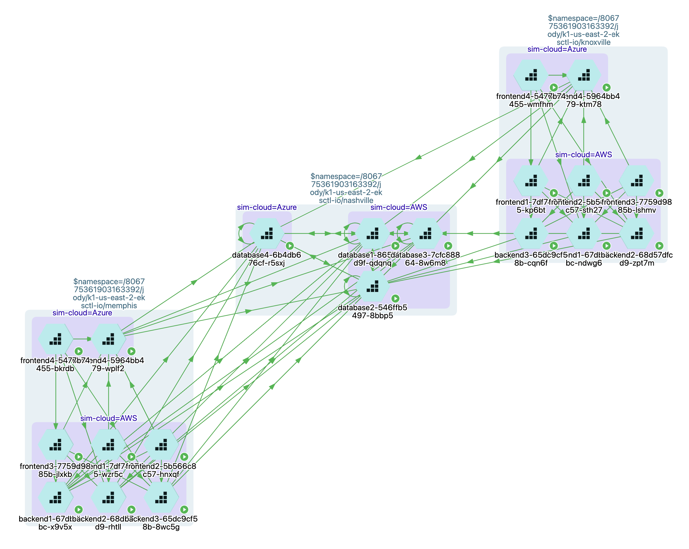

# tennessee

## Overview
This is a simple Kubernetes application that simulates network connectivity between three namespaces running on the same cluster. The namespaces are named Nashville, Memphis and Knoxville. Memphis and Knoxville are sibling cities. Nashville is the state capital. The sibling cities have a dependency on the capital.

## Simulated Cloud, Region & Account
The tags 'sim-cloud', 'sim-region' and 'sim-account' are used for simulation purposes. This allows us to simulate multiple clouds, regions and accounts within our single cluster. To accomplish this each deployment.yaml is composed of multiple deployments with these aforementioned tags. For example a podset named frontend will actually be named frontend1, frontend2, frontend...N.

## Network Flows

### City (Memphis & Knoxville)
A city is composed of a frontend and a backend. The frontend communicates with the backend and the backend communicates with the database running in Nashville. No other flows should be permitted. For clarification the frontend for a given city should only communicate with the backed located in the same city. Frontends should not communicate with each other. Backends should not originate connections to anywhere except the database in Nashville.

### Capital (Nashville)
Nashville simulates a database cluster. It has a single deployment called database. Database podsets communicate with other database podsets and accept inbound from city backends.

## Policy

### Infrastructure
A policy is included that will permit any workload running on the cluster to access the cluster DNS (Kube DNS). This demonstrates how infrastructure policies need only be created once and then inherited by new applications.

### SecOPS / Org
A policy is included that will restrict flows from sim-account=10 to sim-account=30. This demonstrates how the SecOPS team can create policy that is inherited by children and can not be overridden.

### Application
Policy configuration for each namespace is provided. The configuration for Memphis and Knoxville is virtually identical.

## Configuration and Installation

### Prerequisites
You should have a Kubernetes cluster with the Prisma enforcers deployed. Additionally you should have a workstation (Linux or Mac) with the following:
1. Kubernetes binary kubectl and config
2. Prisma binary 'apoctl' and config (if you do not have these see steps to create below)
3. This repo

The binary 'apoctl' should be installed on your workstation in your path
[darwin](https://download.aporeto.com/prismacloud/app2/apoctl/darwin/apoctl)
[linux](https://download.aporeto.com/prismacloud/app2/apoctl/linux/apoctl)

The steps to configure are:
1. Inside Prisma Cloud Microsegmentation change to the top level of the target Kubernetes namespace 
1. Click on the key in the lower left corner. A dialog box titled 'My identity' should appear.
1. Click on the box in the lower right corner to copy the apoctl command into your buffer.
1. Paste and execute this command
1. This should create a directory called .apoctl in your home directory. It should contain two files named default.creds and default.yaml

We will assume the repo is located on your workstation in the directory $repo.

### Deployment
This is an overview. We will have you do these as part of the POV.
1. Change into the directory $repo/tennessee/k8s
1. Execute the script deploy.sh
1. Change into the directory $repo/tennessee/prisma
1. Execute the script deploy.sh

### Rogue Traffic
Rogue traffic can be generated by running the script or scripts in the directory $repo/tennessee/k8s/memphis/rogue or $repo/tennessee/k8s/knoxville/rogue.

### Notes
1. The search/filter capability in the UI can be used to observe this demo only. The filter is "filter=demo"
1. Group on tags such as $namespace, sim-cloud, sim-region, and app
1. Logical groupings are $namespace then sim-cloud, $namespace then sim-cloud then sim-region, sim-account then app

## Demo & POV

### Demo
Have this application up and running. Then start from the App Visibility pane and cover the following.
1. Flow Visibility: Green flows permitted, red flows denied, flows have direction
1. Workload Identity: Show a workload identity (Cloud Provider, Cloud Account, Cloud Region, Cloud VPC, K8S, etc)
1. Show Ruleset and explain
1. Return to visibility and show that flows have matching policy
1. Show logging: Demo search, talk about time window, etc
1. Show namespaces: Drop down in namespace tree and then back up
1. Demo K8S namespace to Prisma namespace mapping

### POV
1. Deploy enforcer(s) on K8S cluster
1. Deploy this application with no policy (learning mode)
1. Observe dotted flows from workloads to Kube-DNS
1. Create Kube-DNS policy
1. Observe DNS dotted flows transitioning to solid
1. Observe dotted flows from workloads to workloads (application)
1. Create policy for application
1. Observe application dotted flows transitioning to solid
1. Disable learning mode
1. Run scripts to generate rouge traffic
1. Observe flows are denied
1. Policy should be "default deny"
1. Wait for denied flows to age out (5 minutes)
1. Create SecOPS policy to restrict simulated account 10 to 30 (sim-account=10 to sim-account=30)
1. Observe flows are denied
1. Check that policy is "SecOPS"

## Screen Shots

### App

### Account then App

### Namespace then Cloud

